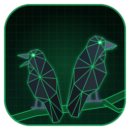

<p align="center"></p>

<h1 align="center">ygg-watchdog</h1>

Сторож для [Yggdrasil](https://yggdrasil-network.github.io/): следит за пирами и сам чинит связь, когда они отваливаются. Есть версии для Linux (Python + systemd) и Windows (C++ + Планировщик заданий).

## Быстрый старт

| Система | Что сделать |
|---|---|
| Windows | Скачать `ygg-watchdog-windows.zip` из [Releases](https://github.com/Yozmor/ygg-watchdog/releases) → распаковать → двойной клик по `ygg_watchdog.exe` → в меню нажать **2** |
| Linux | `git clone https://github.com/Yozmor/ygg-watchdog.git && cd ygg-watchdog/linux && sudo ./install.sh` |

## Что делает

Каждые 3 минуты программа проверяет пиры Yggdrasil и действует сама:

- **Все основные пиры легли** — ищет замену из того же региона в публичном списке пиров, проверяет кандидатов настоящим рукопожатием и добавляет рабочего как резервного.
- **Основной пир снова жив** — резервные убираются.
- **Пропал интернет целиком** — не тратит время на бесполезный поиск пиров, ждёт восстановления и записывает в лог, когда связь пропала и когда вернулась.
- **Региональный режим** — можно выбрать страну и город, и сторож будет держать пиры, ближайшие к этому городу (по реальным координатам из базы GeoNames).

Для ручного управления есть меню: статус, добавление и удаление основных пиров, региональный режим, перезапуск Yggdrasil (в том числе с задержкой, чтобы не оборвать свою же SSH-сессию, если подключён через Yggdrasil).

**Уведомления в Telegram** (необязательно): бот присылает сообщение, когда основные пиры легли и найдена замена, когда они вернулись и когда пропадал интернет. Рутинные проверки «всё в порядке» не присылаются. Если несколько устройств шлют уведомления одному боту, в каждом сообщении указано имя устройства.

## Установка

### Windows

**Вариант 1. Готовая программа (проще всего)**

1. Открой раздел [**Releases**](https://github.com/Yozmor/ygg-watchdog/releases) справа на странице репозитория.
2. В последнем релизе скачай файл **`ygg-watchdog-windows.zip`**.
3. Распакуй его в постоянную папку, например `C:\Tools\ygg-watchdog`. Не запускай прямо из архива и не держи в «Загрузках»: планировщик запомнит путь.
4. Дважды кликни **`ygg_watchdog.exe`**. Windows спросит права администратора, соглашайся. Откроется меню.
5. В меню нажми **2** и Enter: установится задача Планировщика. Готово, теперь сторож сам проверяет пиры каждые 3 минуты, даже когда ты не вошёл в систему.

**Вариант 2. Собрать из исходника** (если релиза нет или ты поменял код)

1. Зелёная кнопка **Code → Download ZIP**, распакуй.
2. Открой папку **`windows`** и запусти **`run_ygg_watchdog.bat`**. Он сам соберёт `ygg_watchdog.exe` с иконкой и откроет меню.
3. Для сборки нужен компилятор: [MinGW-w64](https://winlibs.com/) (распаковать и добавить папку `bin` в PATH) или Visual Studio с компонентом «Разработка классических приложений на C++».

> Файлы `cities.dat` и `notify.conf.example` должны лежать в одной папке с exe.

Подробно про меню и настройки: [windows/README_WINDOWS.md](windows/README_WINDOWS.md)

### Linux

Нужны Python 3, systemd и установленный Yggdrasil.

```bash
git clone https://github.com/Yozmor/ygg-watchdog.git
cd ygg-watchdog/linux
sudo ./install.sh
```

Установщик скопирует программу в `/opt/ygg-watchdog`, включит systemd-таймер (проверка каждые 3 минуты) и добавит команду `ygg-watchdog` для меню. Повторный запуск обновляет программу, настройки и логи сохраняются. Удалить: `sudo ./install.sh --remove`.

```bash
ygg-watchdog                                  # меню
sudo python3 /opt/ygg-watchdog/selftest.py    # самопроверка
tail -f /opt/ygg-watchdog/watchdog.log        # лог
```

Подробно: [linux/README_LINUX.md](linux/README_LINUX.md)

## Уведомления в Telegram

1. Создай бота через `@BotFather` (`/newbot`) и получи токен.
2. Напиши своему боту любое сообщение.
3. Открой `https://api.telegram.org/bot<ТОКЕН>/getUpdates` и найди число в `"chat":{"id": ...}`.
4. Переименуй `notify.conf.example` в `notify.conf` и впиши:

```
BOT_TOKEN=123456:ABC-DEF...
CHAT_ID=987654321
```

На Windows, если Telegram у тебя открывается только через локальный прокси, впиши его в `PROXY=адрес:порт` в том же файле.

Без `notify.conf` уведомления просто выключены, всё остальное работает.

## Команды без меню (Linux)

```bash
cd /opt/ygg-watchdog
sudo python3 watchdog_daemon.py tick                          # одна проверка
sudo python3 watchdog_daemon.py status                        # статус
sudo python3 watchdog_daemon.py list-countries                # список стран
sudo python3 watchdog_daemon.py list-cities russia            # города страны
sudo python3 watchdog_daemon.py add-region russia Vladivostok # включить регион
sudo python3 watchdog_daemon.py remove-region                 # выключить регион
sudo python3 watchdog_daemon.py add-main-peer tls://host:port # добавить основной пир
sudo python3 watchdog_daemon.py restart-yggdrasil-delayed 15  # перезапуск через 15 с
```

## Состав репозитория

```
linux/      Python-версия: watchdog_daemon.py (меню и команды), watchdog_core.py (логика),
            peer_database.py (пиры и города), selftest.py, systemd-таймер, install.sh
windows/    C++-версия: ygg_watchdog.cpp, run_ygg_watchdog.bat (сборка и меню), иконка
assets/     картинки для README
.github/    автосборка exe и архивов для релизов
```

В обеих папках лежит `cities.dat`: база городов GeoNames с координатами, без неё региональный поиск не работает. Там же `notify.conf.example`, пример настроек Telegram.

## Выпуск новой версии

Создай тег, например `v1.1`, и отправь его на GitHub (или создай релиз на сайте с новым тегом). GitHub Actions сам соберёт `ygg_watchdog.exe` с иконкой, упакует обе версии в zip и приложит их к релизу.

Публичные пиры берутся из списка [yggdrasil-network/public-peers](https://github.com/yggdrasil-network/public-peers), координаты городов — из [GeoNames](https://www.geonames.org/) (CC BY 4.0).
